# 🏛️ Prism Project Architecture

This document provides a visual overview of the dependency structure of the Prism rendering engine, from a high-level view down to the internal class relationships.

---

## High-Level Project Dependency Graph

This graph shows how the main project components (the demo application, the core library, and the unit tests) interact with each other and with external libraries.

```mermaid
graph TD;
    subgraph "External Dependencies"
        YAML_CPP["📚 yaml-cpp"];
        GTEST["🧪 GoogleTest"];
    end

    subgraph "Prism Project"
        DEMO["💻 prism_demo (Demo App)"];
        PRISM_LIB["🎨 Prism (Library)"];
        TESTS["⚙️ runTests (Unit Tests)"];
    end

    DEMO --> PRISM_LIB;
    TESTS --> PRISM_LIB;
    TESTS --> GTEST;
    PRISM_LIB --> YAML_CPP;
```

---

## Internal Library Dependencies

This section details the dependencies within the Prism library, divided into different levels of abstraction for greater clarity and understanding of the project's architecture.

---

### 1. Dependencies between Modules (High-Level Overview)

This graph shows the high-level dependencies between the main modules of the Prism library. An arrow from A to B indicates that Module A depends on Module B.

```mermaid
graph TD;
    CORE["🔧 Core"];
    OBJECTS["🧩 Objects"];
    SCENE["🎬 Scene"];

    OBJECTS --> CORE;
    SCENE --> CORE;
    SCENE --> OBJECTS;
```

---

### 2. Internal Dependencies by Module

These graphs detail the relationships between the classes within each module. To simplify, common dependencies to basic types from other modules (like the Core classes) are abstracted and not explicitly shown here.

#### 2.1. Module: Core

This graph focuses on the internal dependencies of the fundamental math and data type classes within the Core module.

```mermaid
graph TD;
    subgraph "Core"
        RAY["➡️ Ray"];
        POINT3["📍 Point3"];
        VECTOR3["📏 Vector3"];
        MATRIX["🧮 Matrix"];
        MATERIAL["✨ Material"];
        COLOR["🌈 Color"];
        STYLE["🎨 Style"];
        INIT["🔧 Init"];
        UTILS["🛠️ Utils"];
    end

    INIT --> STYLE;
    MATRIX --> POINT3;
    MATRIX --> VECTOR3;
    POINT3 --> VECTOR3;
    VECTOR3 --> POINT3;
    RAY --> POINT3;
    RAY --> VECTOR3;
    RAY --> MATRIX;
    UTILS --> MATRIX;
    UTILS --> POINT3;
    UTILS --> VECTOR3;
```

---

#### 2.2. Module: Objects

This graph illustrates the dependencies between the objects and the associated I/O classes, excluding dependencies on basic Core types.

```mermaid
graph TD;
    subgraph " Objects"
        OBJECT["🧩 Object (Base)"];
        SPHERE["⚪ Sphere"];
        PLANE["🌐 Plane"];
        TRIANGLE["🔺 Triangle"];
        MESH["🧊 Mesh"];
        OBJ_READER["📑 ObjReader"];
        COLORMAP["🌈 ColorMap"];
    end

    MESH --> OBJECT;
    MESH --> OBJ_READER;
    OBJ_READER --> COLORMAP;
    SPHERE --> OBJECT;
    PLANE --> OBJECT;
    TRIANGLE --> OBJECT;
```

---

#### 2.3. Module: Scene

This graph details the relationships within the scene module, including the interaction with the external YAML dependency.

```mermaid
graph TD;
    subgraph "Scene Management"
        SCENE["🎬 Scene"];
        CAMERA["📷 Camera"];
        SCENE_PARSER["📄 SceneParser"];
    end

    subgraph "External Dependency"
        YAML_CPP["📄 yaml-cpp"];
    end

    SCENE --> CAMERA;
    SCENE_PARSER --> CAMERA;
    SCENE_PARSER --> YAML_CPP;
    SCENE_PARSER --> SCENE;
```

