# 🏛️ Prism Project Architecture

This document provides a visual overview of the dependency structure of the Prism rendering engine, from a high-level view down to the internal class relationships.

## High-Level Project Dependency Graph

This graph shows how the main project components (the demo application, the core library, and the unit tests) interact with each other and with external libraries.

```mermaid
graph TD;
    subgraph "External Dependencies"
        YAML_CPP["📚 yaml-cpp"];
        GTEST["🧪 GoogleTest"];
    end

    subgraph "Prism Project"
        DEMO["💻 prism_demo (Demo App)"];
        PRISM_LIB["🎨 Prism (Library)"];
        TESTS["⚙️ runTests (Unit Tests)"];
    end

    DEMO --> PRISM_LIB;
    TESTS --> PRISM_LIB;
    TESTS --> GTEST;
    PRISM_LIB --> YAML_CPP;

    style DEMO fill:#cce5ff,stroke:#333,stroke-width:2px;
    style TESTS fill:#d5e8d4,stroke:#333,stroke-width:2px;
    style PRISM_LIB fill:#ffcce5,stroke:#333,stroke-width:2px;
    style YAML_CPP fill:#fff2cc,stroke:#333,stroke-width:2px;
    style GTEST fill:#fff2cc,stroke:#333,stroke-width:2px;
```

## Internal Library Dependencies

This graph shows the relationships between the major classes within the Prism library itself.

```mermaid
graph TD;
    subgraph "High-Level Management"
        SCENE_PARSER["📄 SceneParser"];
        SCENE["🎬 Scene"];
        CAMERA["📷 Camera"];
    end

    subgraph "Geometric Objects (Hittables)"
        OBJECT["🧩 Object (Base)"];
        SPHERE["⚪ Sphere"];
        PLANE["🌐 Plane"];
        TRIANGLE["🔺 Triangle"];
        MESH["🧊 Mesh"];
    end

    subgraph "Core Math & Data Structures"
        RAY["➡️ Ray"];
        POINT3["📍 Point3"];
        VECTOR3["📏 Vector3"];
        MATRIX["🧮 Matrix"];
        MATERIAL["✨ Material"];
        COLOR["🌈 Color"];
        OBJ_READER["📑 ObjReader"];
    end

    %% High-level dependencies
    SCENE_PARSER --> SCENE;
    SCENE_PARSER --> CAMERA;
    SCENE_PARSER --> MESH;
    SCENE_PARSER --> SPHERE;
    SCENE_PARSER --> PLANE;
    SCENE_PARSER --> TRIANGLE;
    SCENE_PARSER --> MATERIAL;

    SCENE --> CAMERA;
    SCENE --> OBJECT;
    SCENE --> RAY;
    SCENE --> COLOR;
    
    CAMERA --> RAY;
    CAMERA --> MATRIX;
    CAMERA --> POINT3;
    CAMERA --> VECTOR3;

    %% Geometric object dependencies
    MESH --> OBJECT;
    MESH --> OBJ_READER;
    MESH --> TRIANGLE;
    MESH --> MATERIAL;

    SPHERE --> OBJECT;
    PLANE --> OBJECT;
    TRIANGLE --> OBJECT;

    OBJECT --> RAY;
    OBJECT --> MATRIX;
    OBJECT --> MATERIAL;

    OBJ_READER --> MATERIAL;
    OBJ_READER --> COLOR;
    OBJ_READER --> VECTOR3;
    OBJ_READER --> POINT3;

    %% Core math dependencies
    RAY --> POINT3;
    RAY --> VECTOR3;
    RAY --> MATRIX;
    
    MATRIX --> POINT3;
    MATRIX --> VECTOR3;
    
    POINT3 --> VECTOR3;
    VECTOR3 --> POINT3;
```

