# PG_Project

## Prerequisites

To build and run this project, you will need:

* **Git**
* **CMake** (version 3.22 or higher recommended)
* A **C++17 compliant compiler** (e.g., GCC, Clang, MSVC)

## Building the Project

This project uses **CMake Presets** (`CMakePresets.json`) to manage all build configurations. This is the recommended way to configure and build.

The following presets are available:

* **`debug`**: Compiles in Debug mode with tests enabled. Ideal for development.
* **`release`**: Compiles in Release mode with optimizations and without tests. Ideal for production/distribution.

### Instructions (Command Line)

1. **Clone the repository:**

    ```sh
    git clone <repository-url>
    cd <repository-name>
    ```

2. **Configure the project using a preset:**
    *This step only needs to be done once, or when you want to switch presets.*

    ```sh
    # To configure a debug build with tests
    cmake --preset debug

    # OR

    # To configure a release build without tests
    cmake --preset release
    ```

    This will generate a `build/debug` or `build/release` directory with the necessary build files.

3. **Build the project:**

    ```sh
    # To build the active debug configuration
    cmake --build --preset debug

    # OR

    # To build the active release configuration
    cmake --build --preset release
    ```

---

## Running the Application

The executable (`PG_Project`) will be located in the `bin` subdirectory of your build folder.

```sh
# Example for the debug build
./build/debug/bin/PG_Project
```

---

## Running Tests

Tests are only available in the **`debug`** preset.

1. Make sure you have configured and built the project using the `debug` preset.

2. **Run from the command line:**

    ```sh
    # Run all tests
    ctest --preset test

    # Run tests with detailed output
    ctest --preset test --verbose
    ```

---

## Installation

This project includes rules to create a clean, distributable package in a local `install` directory. This is useful for testing the final deployment or for packaging your application.

1. First, configure and build the project (e.g., using the `release` preset).

2. Run the install command from the **root directory of the project**:

    ```sh
    # This will install the release build into the `install/release` directory
    cmake --install build/release
    ```

    The `install/release` folder will then contain the `PG_Project` executable and the `libPrism.so` (or `Prism.dll`) library, ready to be run together.

## Code Formatting

This project uses `clang-format` to maintain a consistent code style across the entire codebase. A configuration file (`.clang-format`) is included in the project root to define the style rules.

Before committing any changes, please format your code.

### Installing clang-format

You must have `clang-format` installed on your system. On Debian/Ubuntu-based systems, you can install it with:

```sh
sudo apt install clang-format
```

### Formatting the Entire Project

To format all `.hpp` and `.cpp` files in the `src`, `libs`, and `tests` directories at once, run the following command from the **root directory of the project**:

```sh
find src demo tests -name "*.cpp" -o -name "*.hpp" | xargs clang-format -i
```

**What this command does:**

* `find src libs tests ...`: Searches for files within the `src`, `libs`, and `tests` folders.
* `-name "*.cpp" -o -name "*.hpp"`: Finds files that end in `.cpp` OR `.hpp`.
* `| xargs clang-format -i`: For every file found, it runs the command `clang-format -i` to format it in-place.

---

## 🏛️ Project Architecture

The project is organized into three main components: the core `Prism` library, a `prism_demo` application that uses the library, and a `runTests` executable for unit testing. The dependencies are managed by CMake and are visualized below.

```mermaid
graph TD;
    subgraph "External Dependencies"
        YAML_CPP["📚 yaml-cpp"];
        GTEST["🧪 GoogleTest"];
    end

    subgraph "Prism Project"
        DEMO["💻 prism_demo (Demo App)"];
        PRISM_LIB["🎨 Prism (Library)"];
        TESTS["⚙️ runTests (Unit Tests)"];
    end

    DEMO --> PRISM_LIB;
    TESTS --> PRISM_LIB;
    TESTS --> GTEST;
    PRISM_LIB --> YAML_CPP;

    style DEMO fill:#cce5ff,stroke:#333,stroke-width:2px;
    style TESTS fill:#d5e8d4,stroke:#333,stroke-width:2px;
    style PRISM_LIB fill:#ffcce5,stroke:#333,stroke-width:2px;
    style YAML_CPP fill:#fff2cc,stroke:#333,stroke-width:2px;
    style GTEST fill:#fff2cc,stroke:#333,stroke-width:2px;
```



For a more detailed breakdown of the internal library dependencies, please see the ARCHITECTURE.md file.

---
